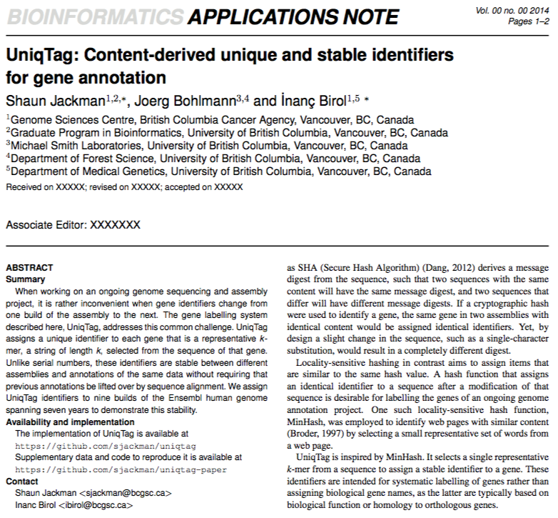

Open and reproducible science
================================================================================

+ Open science
+ Repeatable science
	- by you
	- by others
+ Reproducible science

Open science
================================================================================

+ Publish all research outputs
+ Archive manuscripts
+ Sign peer reviews
+ Participate in public discussion, like [Twitter][]

[Twitter]: http://twitter.com/

Publish all research outputs
================================================================================

+ Posters on [figshare][]
+ Slides on [SpeakerDeck][] or [slideshare][]
+ Code and data in [GitHub][]
+ Data in a plain-text format, like TSV
+ Archive manuscript on [bioRxiv][] or [arXiv][]

[figshare]: http://figshare.com/
[SpeakerDeck]: https://speakerdeck.com/
[slideshare]: http://www.slideshare.net/
[GitHub]: https://github.com/
[bioRxiv]: http://biorxiv.org/
[arXiv]: http://arxiv.org/

Repeatable science
================================================================================

+ Given the same data and code&hellip;
+ Reproduce the same results
+ At least by you, this should be the minimum bar
+ Hopefully repeatable by others as well

Reproducible science
================================================================================

+ Given the manuscript, someone else can&hellip;
+ Repeat the experiment
+ Analyse the data
+ Arrive at the same conclusion

Repeatable vs. reproducible science
================================================================================

+ Reproducibility is fundamental to science
+ Often we don't even accomplish repeatable science
+ So let's start there

Managing software versions and dependencies
================================================================================

+ Use [Homebrew][] or [Linuxbrew][] and [Homebrew-science][] to install software
+ To report versions of all software used, need only write&hellip;

> Homebrew was used to install the required software from Homebrew-science version 2014-08.

[Homebrew]: http://brew.sh
[Linuxbrew]: http://brew.sh/linuxbrew/
[Homebrew-science]: http://brew.sh/homebrew-science/

Homebrew is the solution to dependency hell
================================================================================


Publish data
================================================================================

> Best way to set back your competitors is to release your #data. That way they have to analyze their data & *your* data
&mdash; @[ctitusbrown][]
| [BOSC 2014 keynote][]
| [A History of Bioinformatics (in the Year 2039)][]

[ctitusbrown]: https://twitter.com/ctitusbrown
[BOSC 2014 keynote]: http://video.open-bio.org/video/1/a-history-of-bioinformatics-in-the-year-2039
[A History of Bioinformatics (in the Year 2039)]: http://www.slideshare.net/c.titus.brown/2014-bosckeynote

Version control
================================================================================

+ git/[GitHub][] for (almost) everything!
+ Maybe not big data
+ Experimental design data
+ Results and summary statistics
+ Data in TSV format
+ GitHub renders TSV pretty!


A reproducible manuscript
================================================================================

One Makefile script
-------------------

+ Downloads the data
+ Runs the analyses
+ Generates the tables
+ Renders the figures using R and ggplot2
+ Renders the supplementary material using RMarkdown
+ Renders the manuscript using Pandoc

Turns this
================================================================================


Into this
================================================================================



Document workflow
================================================================================

Courtesy of [Plain Text, Papers, Pandoc][] by [Kieran Healy][]


[Plain Text, Papers, Pandoc]: http://kieranhealy.org/blog/archives/2014/01/23/plain-text/
[Kieran Healy]: http://kieranhealy.org/

Make is beautiful
================================================================================

+ Give it rules to create one type of file from another
+ Tell it what you files you want to create
+ Make looks at which files you have
+ and figures out how to create the files you want

Bioinformatics pipeline using Make
================================================================================

```Makefile
%.bam: %.sam
	samtools view -Sb $< >$@

%.sort.bam: %.bam
	samtools sort $< $*.sort

%.bam.bai: %.bam
	samtools index $<
```

```sh
touch hello.sam
make hello.sort.bam.bai
```

```sh
samtools view -Sb hello.sam >hello.bam
samtools sort hello.bam hello.sort
samtools index hello.sort.bam
```

Markdown for the manuscript
================================================================================

Markdown is a simple typesetting language

```markdown
A header
========

A list:

+ This text is *italic*
+ This text is **bold**
```

A header
--------

A list:

+ This text is *italic*
+ This text is **bold**

RMarkdown for the supplementary material
================================================================================

+ RMarkdown interleaves text with code in R
+ Code that calculates summary statistics
+ Code that generates tables
+ Code that renders figures

Pandoc
================================================================================

Pandoc converts between every file format known to man (just about)

+ Markdown
+ HTML
+ LaTeX
+ PDF
+ ODT and docx (yes, really)
